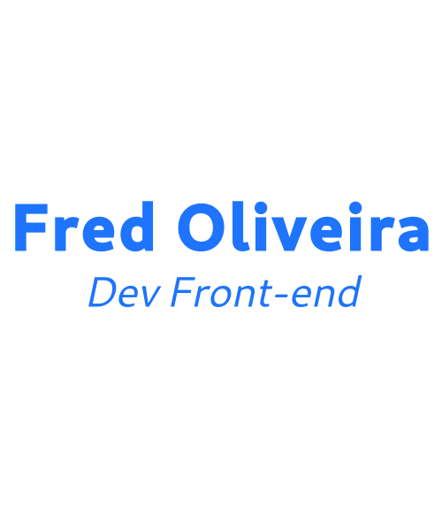

  
    
  </a>
  
    
  </a>

  
  

## Olá! </h2>

### Resumo

- 👨‍💻 Atualmente estou trabalhando como **Freelancer**.
- 🌱 Sempre estou me atualizando sobre: **JS, ReactJS e NextJS**.
- 💙 Interesses: Jogos FPS, Séries e fuçar meu Linux Manjaro.

### Linguagens e Stacks

  
  
  
  
  
  
  
  
  

### Você me encontra em 🌎:

- 💼 Connecting and sharing professional updates on <a href="https://www.linkedin.com/">LinkedIn</a>.
- 🐦 Following me on <a href="https://twitter.com">Twitter</a>.

   
  <a href="https://storyset.com/web">Illustration by Freepik Storyset</a>

